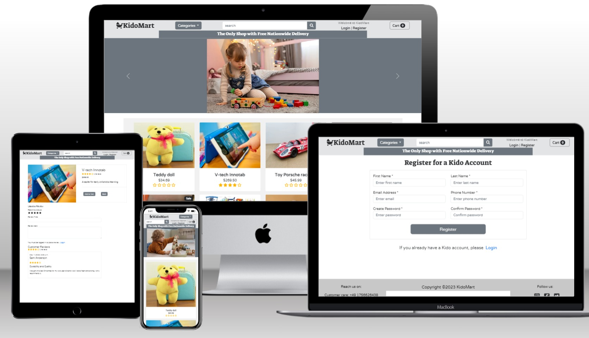
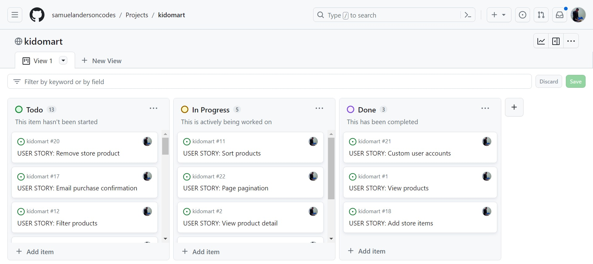
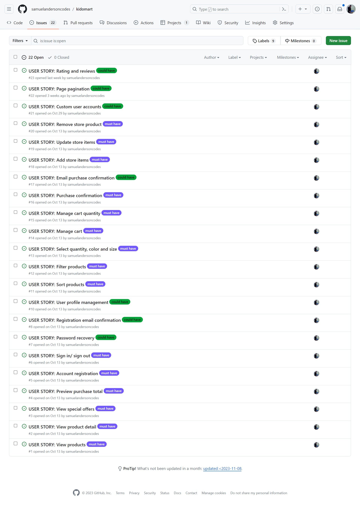

# KidoMart

Kidomart is an e-commerce website that sells a variety of children's products. We give you a wide range of categories consisting of dolls, toys, clothing, electronics, beauty and accessories to choose from. And as part of our inaugurational promotion, we deliver it to your doorstep free of charge.

The live link can be found here: [Live Site - KidoMart](https://kidomart-78f25893d540.herokuapp.com/)

## Table of Contents
- [KidoMart](#kidomart)
  - [Table of Contents](#table-of-contents)
- [User-Experience-Design](#user-experience-design)
  - [The-Strategy-Plane](#the-strategy-plane)
    - [Site-Goals](#site-goals)
    - [Agile Planning](#agile-planning)
      - [Epics](#epics)
      - [User Stories](#user-stories)
  - [The-Scope-Plane](#the-scope-plane)
  - [The-Structure-Plane](#the-structure-plane)
    - [Features](#features)
    - [Features Left To Implement](#features-left-to-implement)
  - [The-Skeleton-Plane](#the-skeleton-plane)
    - [Wireframes](#wireframes)
    - [Database-Design](#database-design)
    - [Security](#security)
  - [The-Surface-Plane](#the-surface-plane)
    - [Design](#design)
    - [Colour-Scheme](#colour-scheme)
    - [Typography](#typography)
    - [Imagery](#imagery)
  - [Technolgies](#technolgies)
  - [Testing](#testing)
  - [Deployment](#deployment)
    - [Version Control](#version-control)
    - [Heroku Deployment](#heroku-deployment)
  - [Credits](#credits)

# User-Experience-Design

## The-Strategy-Plane

### Site-Goals

The website is aimed at providing a platform for parents, wards and children themselves to easily shop online. Registered users are able to easily purchase items ranging from toys to educational essentials online.

Our free inaugral and promotional nation-wide delivery ensures that ordered products with the 'paid' status are rightfully delivered to the associated billing addresses on time.

We look forward to becoming the best seller for children's products.

### Agile Planning

This project was developed using agile methodologies by delivering small features in incremental sprints. There were 8 sprints in total, spaced out evenly over eight weeks.

The kanban issues were assigned to epics and were labelled as 'must have' and 'could have'. They were assigned to sprints based on their level of priority. It was done this way to ensure that core requirements are first taken care of.

The Kanban board was created using github projects and can be located [here](https://github.com/users/samuelandersoncodes/projects/2) Each issue within it consists of a user story, acceptance criteria and tasks that defines the required functionality and its associated tasks to be executed. In total, there were 22 issues. 

### KidoMart Project Board

### KidoMart Issues

#### Epics

The project had 6 main Epics:

**EPIC 1 - Deployment Epic**

The app was first deployed to heroku so that the site is live for users. All dependencies were put in place and thouroughly tested to ensure that the live app is properly set up and has no problems. This epic was implemented first in order to avoid last minute deployment descrepancies. 

**EPIC 2 - Base Setup**

The base setup epic is for all stories needed for the base set up of the application. Without the base setup, the app would not be possible so it was the next epic to be delivered after deployment as all other features depend on it. Here, the home page view, page navigation, product detail views and admin store management were executed.

**EPIC 3 - Registration and User Account**

In the registration and user account epic, user and super user accounts management, user registration, user authentication, password recovery, password recovery email confirmation and user profile management were executed. This epic was very important because shoppers can only make a purchase if they are authenticated. It was therefore considered as the next epic after the base setup.

**EPIC 4 - Product Sorting and Searching Epic**

The Product sorting and searching epic is for all stories related to the product sorting functionality, product categories and the product search functionality. This is very crucial for the grouping of products for easy identification and user search.

**EPIC 5 - Purchasing and Checkout**

The purchasing and checkout epic is for all stories that relate to product purchasing customization, shopping cart management, cart quantity management, checkout summary, order confirmation management, order confirmation email as well as rating and reviews.

**EPIC 6 - Documentation**

This epic is for all documentation related stories and tasks that are needed to document the software development lifecycle of the application. It aims to deliver quality documentation, explaining all stages of development and necessary information on running, deploying and using the application.
